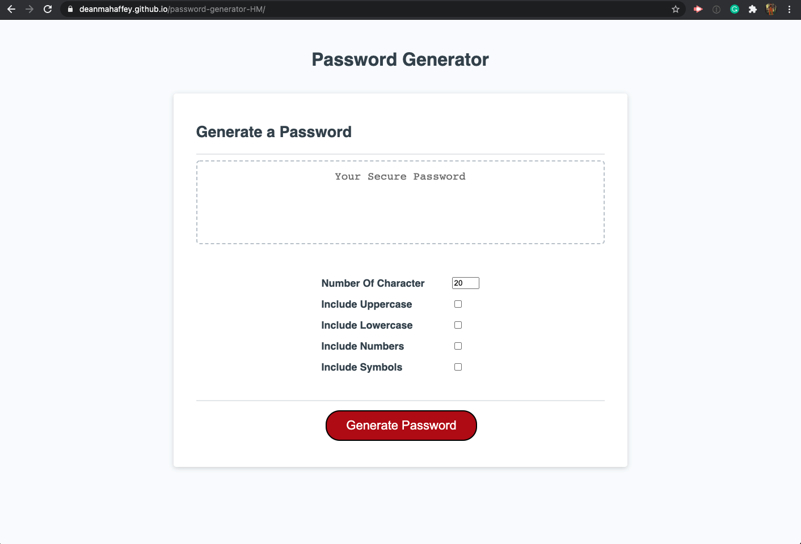

# password-generator-HM

This project is a password generator; it is a useful tool to generate a strong password to your liking. This project was built because I was tired of coming up with my passwords. This project will help you develop a password that will include Uppercase, Lowercase, Numbers, and Symbols that can be 8-128 characters long. Learning Javascript is complicated. Doing this project helped me understand just how each function and how DOM Elements work together. 

Here is the link to the GitHub Pages
[Password Generator](https://deanmahaffey.github.io/password-generator-HM/)

